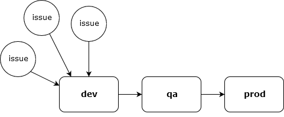

# Change Management Workflow

The ultimate way to contribute to this project — indeed, to _any_ open source software project — is to contribute material changes to its source code, tests and documentation. 

A traditional fork-and-branch workflow is used to manage changes. Each change is initiated by [opening an issue](contributing.md). If the project maintainers accept a proposed change, someone will be assigned to implement it. External contributors will need to fork the source code repository and undertake the work in their fork. When work on an issue is complete, the contributor will submit a pull request to have their changes merged into the project mainline and queued for future release.

#### Branch Naming Conventions

Source code changes flow from multiple ``issue`` branches into the ``dev`` branch, then to the ``qa`` branch, and ultimately to the master ``prod`` branch when the changes are formally released in a new version of the software.



Most changes should not be commited directly into the mainline branches, ``dev``, ``qa`` or ``prod``. Instead, contributors should branch off and do their work in temporary branches. Ideally, there should be a one-to-one relationship between each of these working branches and open issues. To enforce this, the following branch naming convention is used:

```
issue-[number]/[description]
```

``[number]`` is the number of the corresponding issue and ``[description]`` is a concise slug that describes the feature or bug being implemented in the branch. Example:

```
issue-21/tweak-line-height-of-headings
```

The ``dev`` (development) branch is where changes are first merged into the project from the various ``issue`` branches. This is the first step to preparing a new release of the software. Changes are merged only when the project maintainers wish to include them in the next release. The ``dev`` branch may, at times, be unstable, if there are conflicts between multiple merged changes. The project maintainers may directly commit patches into the ``dev`` branch to resolve such merge conflicts.

When all changes for the next release are merged into ``dev`` and that branch is proven to be stable, ``dev`` is merged into ``qa`` (quality assurance). This is where final checks are undertaken (e.g. code review and integration tests) and the release is prepared (e.g. CHANGELOG update and release tagging).

Finally, a new release of the software is made formal when ``qa`` is merged into ``prod`` (production) and the release is registered via the GitHub interface.

#### Atomic Changes

As a general rule, each contribution should be the work of a single author and be highly focused in its scope, representing a single distinct change. Multiple orthogonal changes should not be mixed together in a single contribution. Doing so makes it harder for the project's maintainers to manage changes and keep track of the state of the project.

Ideally, each contribution will be represented by:

* One open issue in the issue tracker
* One ``issue`` branch where the changes are first implemented
* One author, who is the solo commiter to the ``issue`` branch
* One pull request from that ``issue`` branch to the ``dev`` branch
* A single entry in the CHANGELOG

#### Contributing Step-by-Step

1.  **Open an issue**

    Before fixing a bug or implementing a new feature, a new issue should be opened in the project's [issue tracker][issues]. Please make a note that you are willing to have the work assigned to you. The project maintainers will review your bug report or feature suggestion, and they will accept or reject it before you spend time implementing the fix or enhancement. Read more about this step in ["How to Contribute"](contributing.md).

2.  **Fork**

    If the issue is approved, the next step is to create your own personal fork of the source code repository.

    From the project's homepage on GitHub, click "Fork". The repository will be cloned in your own GitHub account. The fork is your "origin" repository, while the main project repository is referred to as the "upstream" repository.

3.  **Clone**

    Download a copy of your origin repository.

    ```sh
    $ git clone https://github.com/[your-github-username]/[project].git
    ```

    The copy of the project that now exists on your computer is your "local" repository. This is where you'll do your work. 

    When you ran the ``git clone`` command, Git would have automatically added a remote named "origin". You should add another remote that references the "upstream" repository. You'll need this later. From the root directory of your newly cloned local repository, run the following command in your terminal.

    ```sh
    $ git remote add upstream https://github.com/[upstream-user]/[project].git
    ```

4.  **Checkout**

    In your local repository, checkout the ``dev`` branch. This branch is the default branch and it represents the very latest increment of the software. It may even include bug fixes and new features that are not released yet.

    ```sh
    $ git checkout dev
    ```

    If you want to make changes to a legacy release of the software, checkout the relevant versioned ``dev`` branch. Example:

    ```sh
    $ git checkout v1/dev
    ```

5.  **Branch**

    Branch off from the development branch to create your own temporary working branch, where you can implement your changes in isolation from work being done in parallel by other contributors. Please use the following naming convention:

    ```
    issue-[number]/[description]
    ```

    ``[number]`` is the number of the issue that you opened in our issue tracker. ``[description]`` is a concise hyphen-delimited slug that describes the feature or bug. Example:

    ```
    issue-21/tweak-line-height-of-headings
    ```

    This naming convention helps the project maintainers to manage external contributions, because each pull request will explicitly reference an open issue.

    Use the following Git commands to create and switch to your issue branch.

    ```sh
    $ git branch issue-[number]/[description]
    $ git checkout issue-[number]/[description]
    ```

    Or more succinctly:

    ```sh
    $ git checkout -b issue-[number]/[description]
    ```

6.  **Commit**

    Do your work. If you will make substantive changes over a long period, you should make regular commits, organizing your changes in logical increments and iterations.

    ```sh
    $ git add [file1] [file2] [file3]
    $ git commit -m "A description of the change implemented in this commit"
    ```

    Using the ``-a`` flag on the ``commit`` command will give you the opportunity to extend the commit message — which should be short — with a more detailed description.

    ```sh
    $ git commit -a
    ```

    Be sure to add or update the relevant tests and documentation.

7.  **Synchronize**

    Long-lived issue branches should be kept synchronized with the project mainline, so that you're always working with the latest increment of the source code. This means that your work won't diverge too far, reducing the chances of major conflicts when the time comes to merge your changes for the next release of the software.
   
    Use the following commands to fetch the latest changes.

    ```sh
    $ git checkout dev
    $ git pull upstream dev
    ```

    Now return to your issue branch and rebase it on the ``dev`` branch. This will replay your changes after everyone else's changes. In effect, your changes stay at the tip of your issue branch, as though you've just recently made the changes over a fresh fork of the upstream project.

    ```sh
    $ git checkout issue-[number]/[description]
    $ git rebase dev
    ```

    This is a shortcut to pull and rebase from the upstream repository directly:

    ```sh
    $ git pull --rebase upstream dev
    ```

    Remember, if you're introducing changes to a legacy release, be sure to rebase off the appropriate versioned ``dev`` branch.

    ```sh
    $ git pull --rebase upstream dev/v1
    ```

    If you get conflicts during the rebasing process, resolve them and then continue the rebase. Remember, you need to keep your changes synchronised with other changes introduced by other contributors. Do not revert recent changes made by other contributors if they conflict with yours. Rather, it is _your work_ that will need to change to remain compatible with the project mainline.

    ```sh
    $ git add [file1] [file2]
    $ git rebase --continue
    ```

    Power users might like to try interactive rebasing. Add the ``i`` or ``--interactive`` flag to the ``git rebase`` command. You will jump into an editing buffer that will give you the opportunity to clean up your commit history. You can edit and remove individual commits, split them up, reorder them, and even squash some together. For each commit that you made, you can choose to _pick_, _squash_, _edit_ or _drop_.

    * _Pick_: This is the default behaviour when you don't do interactive rebasing. It attempts to merge the commit, but you'll be asked to manually resolve any conflicts that the ``git`` program itself can't handle automatically.
    * _Squash_: A squashed commit will have its changes folded into the contents of the preceding commit.
    * _Edit_: The rebasing process will stop and return you to the shell, with the local filesystem tree reflecting the project's state at the selected commit. The original commit's changes will be staged, ready for inclusion when you run ``git commit``. You can make changes to the original commit, before committing it again. And you can introduce additional commits. Run ``git rebase --continue`` when you're done. You'll be returned to the rebasing process where you left off.
    * _Drop_: This option removes a commit. Use this cautiously. It will cause merge conflicts if any later commits build on the dropped changes.

8.  **Push**

    The process of rebasing gives you the opportunity to sort out conflicts between your work and other people's changes that were recently introduced to the project. The end result is that your final PR will have a nice clean diff, so your work can be integrated faster.

    After rebasing, push your local changes to your remote origin repository. Because rebasing changes history, you should use ``-f`` or ``--force`` to force your the new local history into the remote.

    ```sh
    $ git push -f origin issue-[number]/[description]
    ```

    There is no harm in modifying the history of your ``issue`` branches, because you are the solo commiter to those branches. By comparison, the mainline branches (``dev``, ``qa``, ``prod``) are shared, so commits to these branches should be treated as immutable.

    If you're working on a long-running issue, you should push your work to your origin repository regularly. Use GitHub as a backup service, in case your local repository becomes lost or corrupted.

9.  **Pull Request**

    When your work is done, and with everything pushed to your origin repository, you can request to have your changes merged into the project.

    There should be one PR per issue. However, you don't have to have completed your work before opening a PR. You are welcome to use the PR system to request peer review of work-in-progress. This is useful if you want to get feedback on your work before it is completed. Please tag such PRs "work-in-progress" so the project maintainers know not to merge and release your changes just yet.

    To open a pull request, go to the [Pull Requests][pulls] section of the upstream repository. Click the "New pull request" button. Click "Compare across forks". Choose the following for merge:

    - Base repository: ``[upstream-user]/[project]``
    - Base branch: ``dev``
    - Head repository: ``[your-github-username]/[project]``
    - Head branch: ``issue-[number]/[description]``

    Note that pull requests should be made into the ``dev`` branch, which is the default. Choose the appropriate versioned ``dev`` branch if you're making changs to a legacy version of the software.

    Click the "Create pull request" button. Provide a concise but meaningful title for your PR. Leave a message, which must at the very least contain a link to the original issue in the project's issue tracker. Be sure to leave checked the option to "allow edits from maintainers".

10. **Tidy Up**

    With everything pushed to the remotes, you can safely delete the issue branch from your local repository.

    ```sh
    $ git branch -d issue-[number]/[description]
    ```

    After the maintainers have closed your PR, it will be safe to delete the issue branch from your remote origin repository, too. You can do this via the GitHub UI or from your local machine with the following command:

    ```sh
    $ git push origin --delete issue-[number]/[description]
    ```
